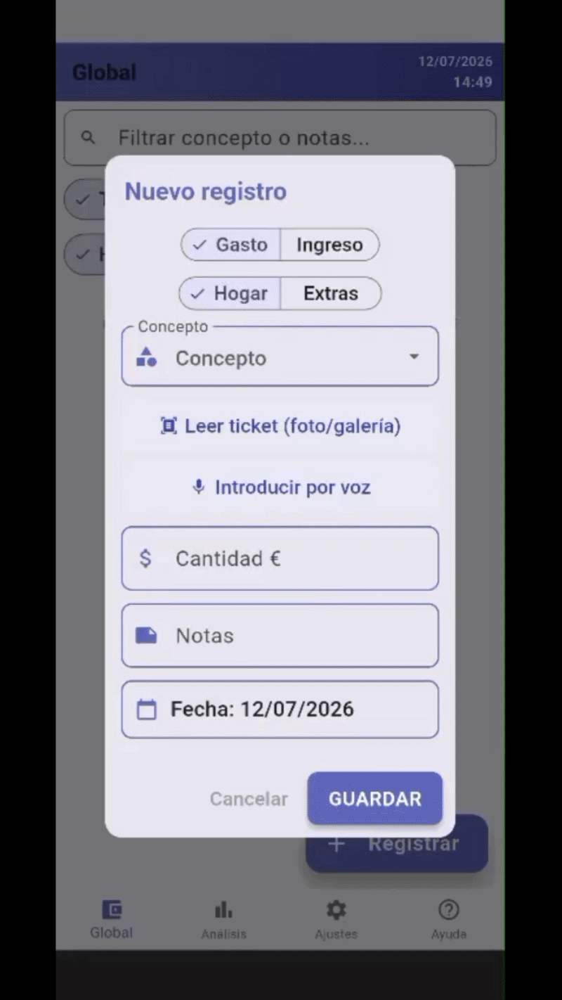
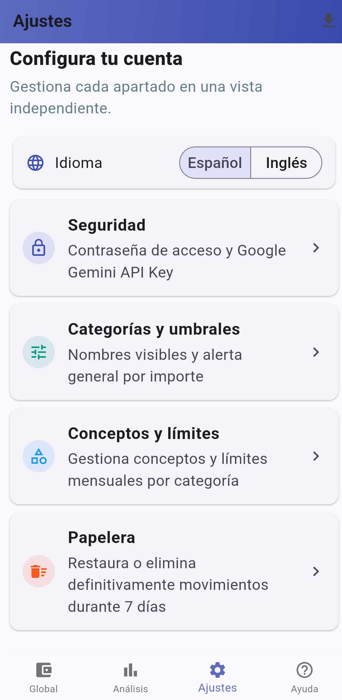

# IWallet

A sleek, feature-rich Flutter personal finance dashboard featuring a dual-engine OCR (ML Kit + Gemini API), intelligent voice input, interactive analytics, reactive state management, and full bilingual support.

## 🚀 Overview

Built with scalability and user experience in mind, IWallet goes far beyond basic CRUD operations. It acts as a comprehensive personal finance dashboard with a minimalist, distraction-free identity (Freemium-ready architecture). It offers intelligent data entry methods and deep analytics to help users maintain total control over their economy without sacrificing privacy or speed.

## ✨ Key Features & Technical Architecture

* **🤖 Dual-Engine OCR (Local & Cloud):** Receipt scanning adapts to the user. By default, it utilizes **Google ML Kit** for instant, 100% offline, privacy-first processing. If a user configures a Gemini API key, the engine seamlessly upgrades to Generative AI for surgical data extraction.
* **🛡️ Fail-Safe Architecture (Automatic Fallback):** Zero downtime data entry. If the Gemini API experiences network drops, timeouts, or HTTP errors, a `try-catch` interceptor silently reroutes the scan to the local ML Kit engine. The user gets their data without crashes or technical errors.
* **🧹 Smart Data Cleaning (Standardization):** Advanced Regex parsers and strict Prompt Engineering proactively filter out noise (addresses, phone numbers, CIFs) from receipts, unifying notes under a strict, clean format: `Comercio: [Name]`.
* **🌍 Bilingual Support (i18n):** Full dynamic localization allowing users to switch instantly between English and Spanish without restarting the application.
* **📊 Advanced Analytics Dashboard:** Interactive comparative bar charts (monthly and weekly). Long-press reveals dynamic daily breakdowns via line charts.
* **🎙️ Intelligent Voice Input:** Speech-to-text recognition with customizable processing rules to automatically assign categories and amounts via NLP.
* **⚙️ High Customization & Security:** Encrypted password protection, custom budget alerts, CSV data export, and a 7-day recovery recycle bin for secure management.

## 🛠️ Tech Stack & Development Flow

* **Framework:** Flutter (Dart)
* **Local Storage:** [Hive](https://pub.dev/packages/hive) (Lightweight NoSQL database for ultra-fast, energy-efficient data and API Key persistence).
* **State Management:** Native and reactive `ValueListenableBuilder` tied to Hive database mutations.
* **AI & Hardware Integration:**
  * **Google ML Kit:** On-device machine learning for offline text recognition.
  * **Gemini API (Flash):** Cloud-based multimodal LLM for advanced semantic parsing.
  * `speech_to_text`: Microphone hardware access.
  * Complex Regex algorithms for natural language processing (entities, dates, amounts).
* **Custom UI & Charts:** Analytical charts natively implemented using `CustomPainter` and `InteractiveViewer` for horizontal scrolling.
* **Security & Data Export:** `crypto` (local SHA-256 hashing), `file_saver`, and `share_plus` for CSV generation.
* **🤖 Development Approach:** Designed and coded in VS Code using **GitHub Copilot** as an AI assistant to accelerate the implementation of complex logic (such as Canvas math and Regex patterns) and increase overall productivity.

## 📱 App Showcase & Key Interactions

### 1. Intelligent Data Entry (Dual OCR & Voice)

The app leverages a hybrid AI architecture to eliminate friction from manual data entry.

<table width="100%" cellspacing="0" cellpadding="0">
  <tr>
    <td width="50%" align="center" valign="top">
      <b>📷 Dual-Logic OCR Scanner</b>
    </td>
    <td width="50%" align="center" valign="top">
      <b>🎙️ Voice Input (NLP)</b>
    </td>
  </tr>
  <tr>
    <td valign="top" align="center">
    
<i>Extracts totals, dates, and clean vendor names using offline ML Kit or advanced Gemini AI with automatic fail-safe fallback.</i>

    
</td>
<td valign="top" align="center">
    
<i>Analyzes amounts, dates, and context to automatically assign categories and concepts.</i>

    
</td>
  </tr>
</table>

> **Note:** Voice-to-text recognition and receipt OCR scanning are continuously optimized. The dual OCR architecture guarantees that if the AI cloud extraction fails or is unavailable, the local ML Kit engine takes over instantly.

 

### 2. Advanced Analytics & Custom Charts

A dedicated dashboard built entirely with custom rendering (`CustomPainter`) for high-performance financial tracking.

<table width="100%" cellspacing="0" cellpadding="0">
  <tr>
    <td width="50%" align="center" valign="top">
      <b>📊 Quick Navigation & Filters</b>
    </td>
    <td width="50%" align="center" valign="top">
      <b>📈 Interaction & Daily Detail</b>
    </td>
  </tr>
  <tr>
    <td valign="top" align="center">
      
<i>Instantly toggle between monthly and weekly comparative views.</i>

      
    </td>
    <td valign="top" align="center">
      
<i>Long press to reveal a line chart with daily breakdowns and dynamic scaling.</i>

      
    </td>
  </tr>
</table>

 

### 3. Comprehensive Management, Settings & Security

Built to be robust, highly customizable, and safe against user error, including encrypted password protection, bilingual toggles, CSV export, and a preventive deletion system.

<table width="100%" cellspacing="0" cellpadding="0">
  <tr>
    <td width="33.3%" align="center" valign="top">
      <b>Swipe</b> 
      
    </td>
    <td width="33.3%" align="center" valign="top">
      <b>Confirm</b> 
      
    </td>
    <td width="33.3%" align="center" valign="top">
      <b>Undo</b> 
      
    </td>
  </tr>
  <tr>
    <td width="33.3%" align="center" valign="top">
       <b>Settings & i18n</b> 
      
    </td>
    <td width="33.3%" align="center" valign="top">
       <b>Trash Bin</b> 
      
    </td>
    <td width="33.3%" align="center" valign="top">
       <b>Password</b> 
      
    </td>
  </tr>
</table>
